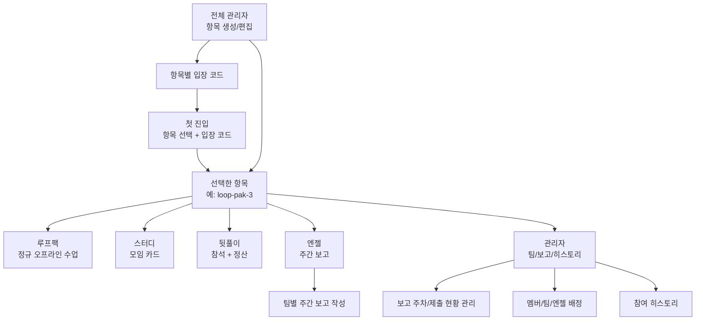
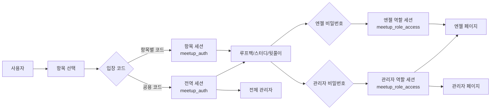
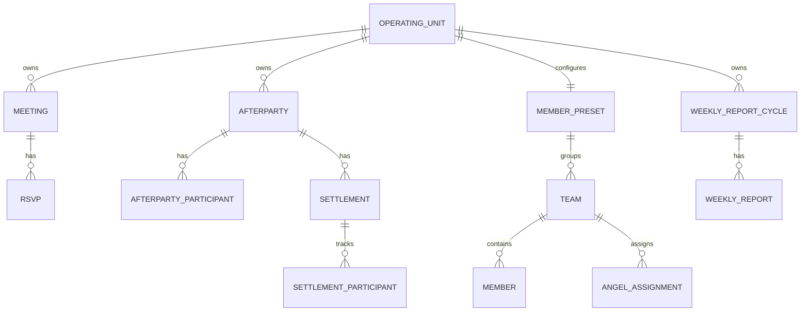

# LOOPERS MEETUP

LOOPERS MEETUP은 루프팩, 스터디, 뒷풀이 운영을 한 곳에서 관리하는 내부 운영 대시보드입니다.

운영자는 항목별 입장 코드로 강의/기수별 공간에 들어갑니다. 기수 화면은 루프팩, 스터디, 뒷풀이, 엔젤, 관리자 탭을 한 세트로 제공하고, 엔젤과 관리자는 별도 비밀번호로 전용 화면에 접근해 주간 보고, 팀 배정, 히스토리, 운영 항목 관리를 수행합니다.

## 한눈에 보기



## 권한 흐름



## 현재 제품 구조

| 영역 | 주요 경로 | 용도 |
|------|-----------|------|
| 첫 진입 | `/` | 항목 선택 드롭다운 + 입장 코드 입력 |
| 루프팩 | `/loop-pak`, `/cohorts/{항목}/loop-pak` | 정규 오프라인 수업 카드 관리 |
| 스터디 | `/`, `/cohorts/{항목}/study` | 스터디 모임 카드 관리 |
| 뒷풀이 | `/afterparty`, `/cohorts/{항목}/afterparty` | 뒷풀이 참석/정산 관리 |
| 엔젤 | `/angel`, `/cohorts/{항목}/angel` | 엔젤 주간 보고 작성 |
| 관리자 | `/cohorts/{항목}/admin` | 선택한 항목의 팀/보고/히스토리 관리 |
| 전체 관리자 | `/admin` | 항목 생성, 편집, 입장 코드 관리 |

`/cohorts/{항목}/{섹션}` 형태의 주소는 내부적으로 기존 화면으로 rewrite됩니다. 예를 들어 `/cohorts/loop-pak-3/afterparty`는 `loop-pak-3` 항목의 뒷풀이 화면으로 동작합니다.

기존 `/cohorts/{항목}/member` 주소는 중복 허브 제거 후 `/cohorts/{항목}/study`로 리다이렉트됩니다. 멤버/팀/엔젤 배정 화면은 관리자 영역의 `/cohorts/{항목}/members`에 남아 있습니다.

## 핵심 기능

### 항목별 운영

- 전체 관리자가 운영 항목을 생성/수정합니다.
- 각 항목은 주소용 슬러그, 표시 이름, 설명, 입장 코드를 가집니다.
- 항목별 입장 코드는 일반 사용자 진입에 사용됩니다.
- 전용 입장 코드가 없는 항목은 공용 `APP_PASSWORD`로 입장합니다.

### 루프팩/스터디 관리

- 날짜별 오프라인 모임 카드 조회
- 모임 생성, 수정, 삭제
- 장소, 시간, 설명, 방장 정보 관리
- 참여자 단건 추가 및 여러 명 일괄 추가
- 멤버/엔젤/서포터/버디/멘토/매니저 역할 구분
- 팀 프리셋 기반 빠른 추가
- 모임별 정원 설정, 대기 요청 관리, 확정/대기 전환
- 모임 상세의 공유 문구 복사
- 지도 링크 폴백 제공

### 뒷풀이/정산 관리

- 날짜별 뒷풀이 카드 조회
- 뒷풀이 생성, 수정, 삭제
- 참여자 추가/삭제
- 정산 묶음 생성
- 정산 담당자와 계좌 정보 관리
- 참여자별 정산 완료 상태 토글

### 멤버/팀 관리

- 팀 추가/수정/삭제
- 팀별 멤버 목록 추가/수정/삭제
- 팀별 엔젤 배정
- 고정 엔젤 디렉터리 관리
- 운영 역할 디렉터리 추가/수정/삭제
- 변경 결과는 하단 토스트로 표시

### 엔젤 주간 보고

- 엔젤 비밀번호로 전용 화면 접근
- 주차별 보고 목록 확인
- 담당 팀의 주간 보고 작성/수정
- 담당 팀 보고를 미제출로 되돌리기
- 관리자 화면에서 주차별 제출 현황 확인

### 관리자 화면

- 기수/항목 관리자: 선택한 항목의 보고 주차, 멤버/팀/엔젤 배정, 히스토리 관리
- 전체 관리자: 항목 생성/편집, 입장 코드, 엔젤 코드, 관리자 코드 관리
- 전체 관리자와 항목 관리자는 화면 파일과 진입 경로가 분리되어 있습니다.

## 데이터 관계



## 권한과 비밀번호

| 구분 | 환경 변수/저장 위치 | 설명 |
|------|----------------------|------|
| 공용 입장 코드 | `APP_PASSWORD` | 기본 사용자 진입 코드 |
| 항목별 입장 코드 | DB 저장 | 전체 관리자 화면에서 생성/변경 |
| 전체 관리자 코드 | `APP_PASSWORD` 기반 전역 인증 | `/admin` 진입에 사용 |
| 항목별 엔젤 코드 | DB 저장 | 선택한 항목의 엔젤 화면 접근 |
| 항목별 관리자 코드 | DB 저장 | 선택한 항목의 관리자 화면 접근 |
| 전역 엔젤 비밀번호 | `ANGEL_PAGE_PASSWORD` | 레거시/전역 엔젤 화면 접근 |
| 전역 관리자 비밀번호 | `ADMIN_PAGE_PASSWORD` | 레거시/전역 관리자 화면 접근 |

엔젤/관리자 역할 접근은 `localStorage`가 아니라 `httpOnly` 쿠키로 저장됩니다. 쿠키는 12시간 유지되며, 관리자 권한은 엔젤 화면도 열 수 있지만 엔젤 권한으로 관리자 화면은 열 수 없습니다.

## 기술 스택

- Next.js 16 App Router
- React 19
- TypeScript
- PostgreSQL (`pg`)
- Tailwind CSS
- Vitest
- Playwright
- Vercel 배포 기준

## 로컬 실행

```bash
npm install
cp .env.example .env.local
npm run dev
```

기본 개발 서버는 `http://localhost:3000`입니다.

`.env.local`에는 실제 값을 넣습니다.

```bash
DATABASE_URL=postgresql://...
NEXT_PUBLIC_BASE_URL=http://localhost:3000
APP_PASSWORD=...
ADMIN_PAGE_PASSWORD=...
ANGEL_PAGE_PASSWORD=...
OPERATING_UNIT_CODE_SECRET=...
OPERATING_UNITS_ENABLED=true
PG_DUMP_BIN=/opt/homebrew/bin/pg_dump
PSQL_BIN=/opt/homebrew/bin/psql
```

## 데이터베이스 운영

스키마 적용/검증:

```bash
node scripts/apply-schema.mjs --env-file .env.local
node scripts/apply-schema.mjs --env-file .env.local --verify-only
```

DB 변경 전 백업:

```bash
npm run db:backup
```

백업 결과는 `backups/` 아래에 SQL 파일과 row count JSON으로 저장됩니다.

DB 연결 확인:

```bash
npm run db:ping
```

## 검증 명령

```bash
npm run typecheck
npm run lint
npm test
npm run build
```

E2E:

```bash
npm run e2e
npm run e2e:ui
```

통합 품질 하네스:

```bash
npm run quality:harness
```

`RUN_E2E=1`을 주면 E2E까지 포함합니다.

## 외부 인수인계 문서

| 문서 | 용도 |
|------|------|
| `docs/architecture.md` | 디렉터리 책임, 요청 흐름, 주요 코드 진입점 |
| `docs/development-guide.md` | 로컬 준비, 변경 종류별 시작점, 검증 게이트 |
| `docs/testing-map.md` | 단위/E2E 테스트가 보호하는 영역과 실행 기준 |
| `docs/ui-ux-principles.md` | 라이브 피드백에서 정리한 UI/UX 운영 원칙 |
| `docs/external-handoff-maintainability-plan.md` | 외부 개발사 인수인계와 유지보수성 개선 장기 계획 |

## 운영 원칙

- DB 변경 전에는 반드시 `npm run db:backup`을 실행합니다.
- 전체 관리자 화면과 항목 관리자 화면은 파일/경로를 분리해 권한 사고를 줄입니다.
- 헤더는 기수별 `루프팩 / 스터디 / 뒷풀이 / 엔젤 / 관리자` 세트를 유지합니다. 중복 허브성 탭은 추가하지 않습니다.
- 정원은 엔젤/운영진을 포함한 전체 확정 인원 기준입니다. 남은 자리까지는 확정으로 들어가고 초과 인원은 대기로 분리합니다.
- 완료 피드백은 화면 하단 중앙 토스트를 기본으로 사용하고, 목록 상단의 지속 배지는 만들지 않습니다.
- PR 검증 기준은 typecheck, lint, test, build 통과입니다.
