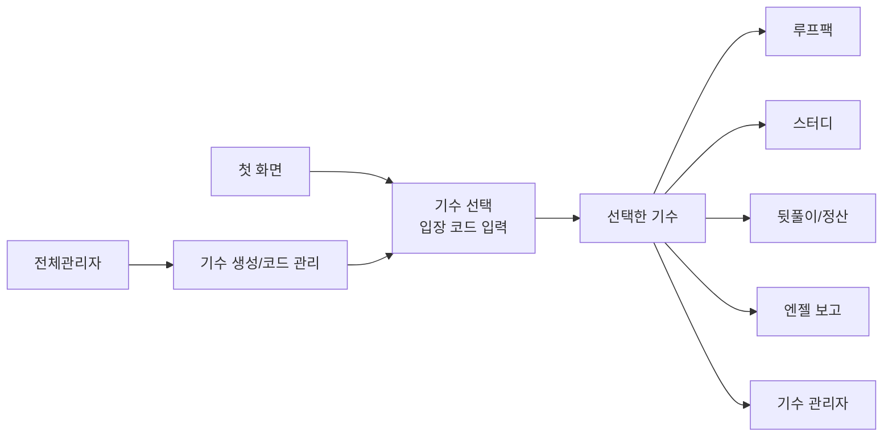

# LOOPERS MEETUP

LOOPERS MEETUP은 루프팩 기수 운영을 위한 내부 대시보드입니다.

한 기수 안에서 루프팩 수업, 스터디 모임, 뒷풀이 정산, 엔젤 주간보고, 관리자 업무를 함께 관리합니다. 처음 인계받는 사람은 이 README를 먼저 읽고, 필요한 문서만 이어서 보면 됩니다.

## 한눈에 보기



## 누가 무엇을 하나요?

| 사용자 | 하는 일 |
| --- | --- |
| 참여자/운영 보조 | 기수 입장 후 루프팩, 스터디, 뒷풀이 현황 확인 |
| 엔젤 | 담당 팀 주간보고 작성 |
| 기수 관리자 | 팀/멤버/엔젤 배정, 보고 주차, 히스토리 관리 |
| 전체관리자 | 기수 생성, 입장 코드/엔젤 코드/관리자 코드 관리 |

## 인계 문서

| 문서 | 읽는 사람 | 내용 |
| --- | --- | --- |
| `docs/README.md` | 모두 | 문서 폴더 안내와 읽는 순서 |
| `docs/handoff-guide.md` | 비개발자/운영자/PM | 제품 구조, 권한, 운영 흐름 |
| `docs/user-guide.md` | 실제 사용자/인수자 | 기능별 사용법과 화면 스크린샷 |
| `docs/operations-setup-guide.md` | 운영자/AI 에이전트 | 배포 URL, DB URL, 관리자 코드 셋팅 |
| `docs/development-guide.md` | 개발자 | 로컬 실행, 환경 변수, 검증 명령 |
| `docs/architecture.md` | 개발자 | 코드 구조, 인증, 데이터 경계 |
| `docs/testing-map.md` | 개발자/QA | 테스트가 보호하는 범위 |
| `docs/migration/*` | 배포/DB 담당자 | 새 DB 구성, 데이터 이전, 롤백 |

## 로컬 실행

```bash
npm install
cp .env.example .env.local
npm run db:ping
npm run dev
```

기본 주소는 `http://localhost:3000`입니다.

## 검증 명령

```bash
npm run typecheck
npm run lint
npm test
npm run build
```

사용자 흐름을 바꿨다면 Playwright E2E도 실행합니다.

```bash
npm run e2e
```

## 스크린샷 갱신

인계용 화면 이미지는 가데이터만 사용합니다.

```bash
BASE_URL=http://localhost:3000 npm run docs:handoff-screenshots
```

결과는 `docs/screenshots/handoff/`에 저장되고, `docs/user-guide.md`에서 참조합니다.
