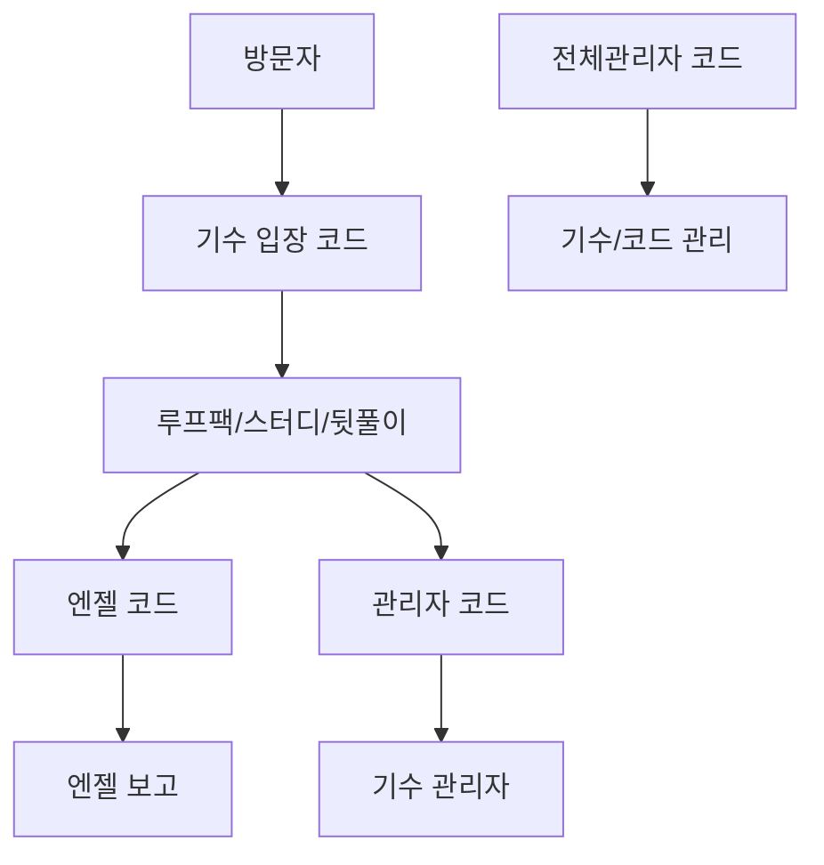

# 현재 제품 상태

작성일: 2026-05-04

## 제품 요약

LOOPERS MEETUP은 기수별 오프라인 운영을 관리하는 내부 도구입니다.

기수별로 입장 코드가 있고, 한 기수 안에서 루프팩, 스터디, 뒷풀이, 엔젤 보고, 관리자 기능을 사용합니다. 전체관리자는 기수와 코드를 관리하고, 기수 관리자는 해당 기수의 팀/멤버/보고/히스토리를 관리합니다.

## 현재 기능 범위

| 영역 | 현재 가능 |
| --- | --- |
| 기수 관리 | 기수 생성, 상세 확인, 수정, 코드 변경, 삭제 확인 |
| 루프팩/스터디 | 일정 카드 생성, 상세 수정, 참여자 추가, 대기/확정 관리, 공유 문구 |
| 뒷풀이 | 뒷풀이 생성, 참여자 관리, 정산 묶음, 정산 완료 체크 |
| 엔젤 보고 | 주차별 팀 보고 작성/수정, 미제출 전환 |
| 기수 관리자 | 팀/멤버/엔젤 배정, 보고 템플릿/주차, 제출 현황, 히스토리 조회 |
| 피드백 | 저장/삭제/조회 중 스피너와 상단 진행바 표시 |

## 권한 구조

## 현재 주의점

- 운영 데이터가 있는 DB에서 테스트할 때는 테스트 기수와 가데이터를 사용합니다.
- 기수 코드 현재값 표시는 암호화 저장을 사용합니다. 과거 평문 값은 재저장 전까지 남아 있을 수 있습니다.
- 서버 화면 파일이 아직 큰 편입니다. 큰 기능을 추가하기 전에는 해당 화면을 작게 나눠 수정하는 것이 안전합니다.
- 운영 유사 환경에서 쓰기 E2E를 실행하면 실제 데이터가 바뀔 수 있습니다.

## 인계 판단

현재 상태는 외부 인계가 가능한 수준입니다. 인계 시에는 아래 네 가지를 함께 전달하면 됩니다.

1. 제품 흐름: `docs/handoff-guide.md`
2. 기능별 사용법: `docs/user-guide.md`
3. 개발 시작 방법: `docs/development-guide.md`
4. DB/배포 이전 절차: `docs/migration/`
