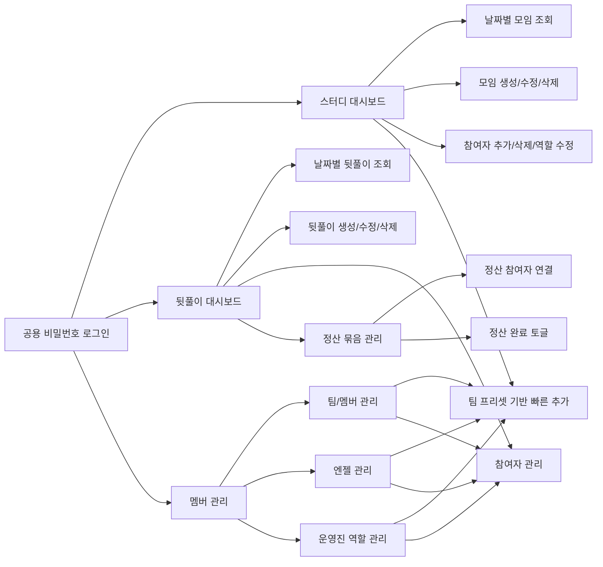
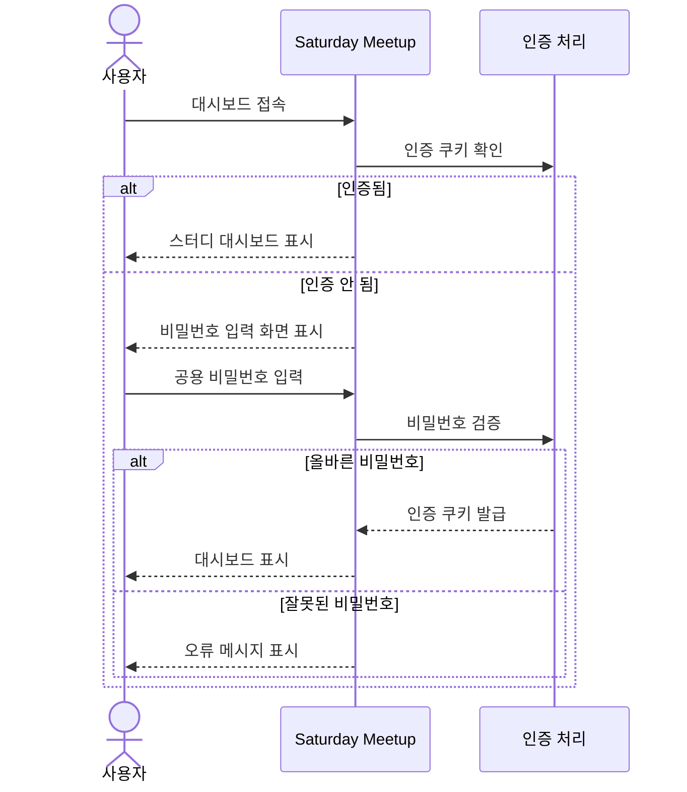
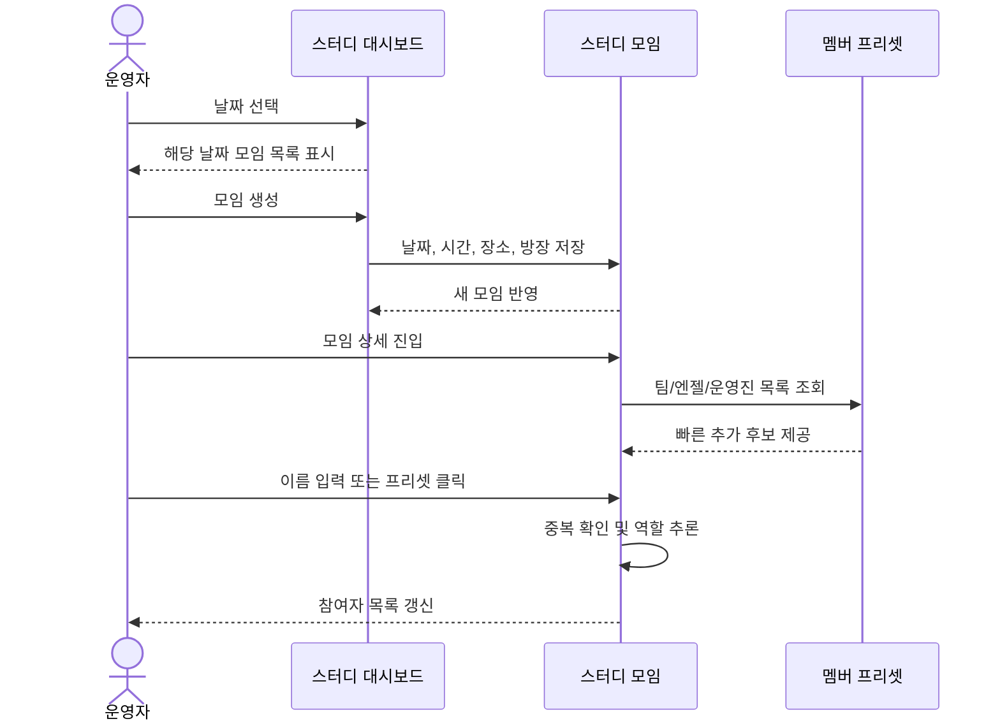
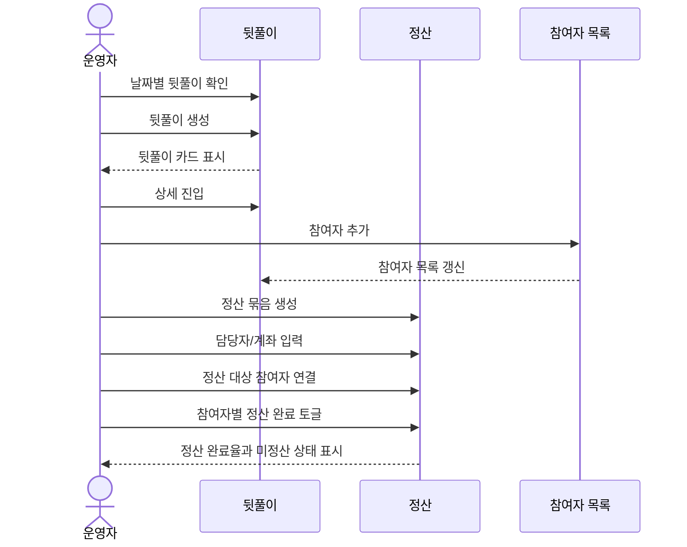
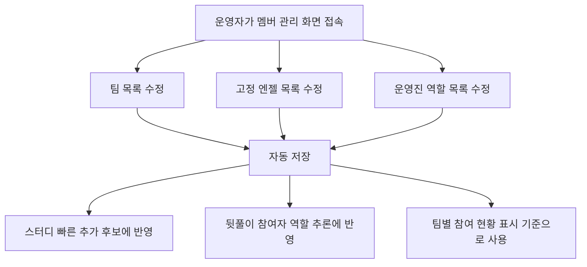

# Saturday Meetup 현재 제품 상황

작성일: 2026-04-26

## 1. 제품 요약

Saturday Meetup은 토요일 오프라인 스터디 운영을 위한 내부 대시보드다. 사용자는 공용 비밀번호로 들어와 날짜별 스터디, 뒷풀이, 정산, 멤버 프리셋을 관리한다.

현재 제품은 초기의 "참석 여부를 직접 등록하는 도구"를 넘어, 운영자가 현장에서 바로 쓰는 관리 도구에 가깝다. 핵심 가치는 "오늘 누가 어디에 참여하고, 뒷풀이와 정산은 어디까지 진행됐는지"를 빠르게 확인하고 수정하는 것이다.

## 2. 주요 사용자

- 운영자: 모임 생성, 참여자 관리, 뒷풀이/정산 관리, 멤버 프리셋 관리
- 스터디 참여자: 공용 비밀번호로 접근해 모임 현황 확인 또는 참여 등록
- 방장/운영진: 모임별 담당자 확인, 참여자와 장소 정보 공유

## 3. 핵심 기능

### 공통 접근 제어

- 공용 비밀번호로 앱 접근
- 로그인 후 스터디, 뒷풀이, 멤버 관리 화면 사용
- 개별 스터디/뒷풀이에는 선택적 수정 비밀번호 설정 가능

### 스터디 운영

- 날짜별 스터디 모임 조회
- 스터디 모임 생성, 수정, 삭제
- 장소, 시간, 설명, 방장 정보 관리
- 참여자 단건 추가 및 여러 명 일괄 추가
- 이름 기반 역할 자동 추론
- 멤버, 엔젤, 서포터, 버디, 멘토, 매니저 등 역할 구분
- 팀 프리셋 기반 빠른 참여자 추가
- 참여자 삭제 및 역할 수정

### 뒷풀이 운영

- 날짜별 뒷풀이 조회
- 뒷풀이 생성, 수정, 삭제
- 뒷풀이 참여자 추가 및 삭제
- 스터디 참여자와 같은 역할 체계 사용
- 뒷풀이별 정산 묶음 관리

### 정산 관리

- 뒷풀이 안에서 여러 정산 묶음 생성
- 정산 담당자와 계좌 정보 관리
- 정산별 참여자 연결
- 참여자별 정산 완료 상태 토글
- 미정산/정산 완료 상태를 운영자가 빠르게 확인

### 멤버 프리셋 관리

- 팀 목록 관리
- 팀별 멤버 관리
- 팀별 엔젤 최대 2명 관리
- 고정 엔젤 디렉터리 관리
- 운영진 역할 디렉터리 관리
- 스터디와 뒷풀이의 빠른 추가 기능에서 프리셋 활용

## 4. 현재 제품 구조

## 5. 사용자 플로우

### 5.1 앱 접근 플로우

### 5.2 스터디 모임 운영 플로우

### 5.3 뒷풀이와 정산 플로우

### 5.4 멤버 프리셋 관리 플로우

## 6. 기술 스택

- 화면 구성: Next.js의 앱 화면 구성 방식, React, TypeScript
- 화면 스타일: Tailwind CSS
- 데이터 저장소: PostgreSQL
- 배포 환경: Vercel 기준
- 테스트 도구: Vitest, Playwright
- 데이터 재사용 방식: Next.js 서버 캐시와 태그 기반 새로고침

## 7. 현재 제품 리스크

### 스키마 기준이 분산되어 있음

문서화된 초기 데이터베이스 생성 스크립트보다 실행 중 스키마 보정 로직이 더 최신이다. 새 데이터베이스를 만들 때 문서만 보고 구성하면 현재 제품 기능 전체가 재현되지 않을 수 있다.

### 운영 권한 경계가 단순함

앱 전체는 공용 비밀번호 기반이고, 일부 수정 작업은 개별 비밀번호로 보호된다. 내부 운영 도구로는 단순하고 빠르지만, 장기 운영 시 권한 분리와 감사 가능성이 부족하다.

### 테스트 환경이 실제 운영 환경과 가깝게 묶여 있음

전체 사용자 흐름 테스트가 실제 배포 주소를 대상으로 하므로 테스트 데이터가 운영 데이터와 섞일 수 있다.

### 화면과 액션의 책임이 커짐

기능이 확장되면서 대시보드, 상세 화면, 서버 액션의 책임이 커졌다. 현재 동작은 검증되지만, 다음 기능 추가 전 구조 정리가 필요하다.
