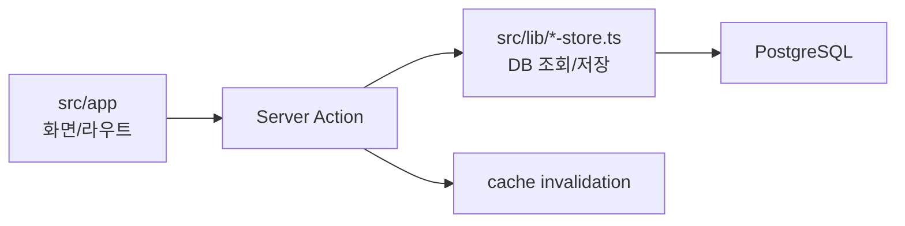

# 개발 시작 가이드

외부 개발자가 처음 변경할 때 필요한 최소 절차입니다.

## 1. 로컬 실행

```bash
npm install
cp .env.example .env.local
npm run db:ping
npm run dev
```

필수 환경 변수:

| 변수 | 용도 |
| --- | --- |
| `DATABASE_URL` | PostgreSQL 연결 |
| `APP_PASSWORD` | 전체관리자/기본 입장 코드 |
| `ADMIN_PAGE_PASSWORD` | 전역 관리자 코드 |
| `ANGEL_PAGE_PASSWORD` | 전역 엔젤 코드 |
| `OPERATING_UNIT_CODE_SECRET` | 기수별 코드 암호화. 없으면 `APP_PASSWORD` 사용 |
| `NEXT_PUBLIC_BASE_URL` | 공유 링크 기준 URL |

## 2. 먼저 돌릴 명령

```bash
npm run typecheck
npm run lint
npm test
npm run build
```

DB나 운영 데이터가 바뀌는 작업 전에는 백업합니다.

```bash
npm run db:backup
```

## 3. 어디를 보면 되나요?



| 바꾸려는 것 | 먼저 볼 파일 |
| --- | --- |
| 모임/참여자/대기 | `src/lib/meetup-store.ts`, `src/app/meetings/[meetingId]/page.tsx` |
| 뒷풀이/정산 | `src/lib/afterparty-store.ts`, `src/app/afterparty/[afterpartyId]/page.tsx` |
| 멤버/팀 | `src/lib/member-store.ts`, `src/app/members/member-admin-form.tsx` |
| 엔젤 보고 | `src/lib/weekly-report-store.ts`, `src/app/angel/reports/**` |
| 관리자 보고 | `src/app/admin/reports/**` |
| 히스토리 | `src/lib/history-store.ts`, `src/app/admin/history/**` |
| 기수/코드 | `src/lib/operating-unit-store.ts`, `src/app/admin/operating-units/**` |
| 권한 | `src/lib/auth.ts`, `src/lib/role-session.ts` |

## 4. 변경 전 체크리스트

- 현재 기수 slug가 명시적으로 전달되는가?
- 저장 후 캐시가 갱신되는가?
- 삭제는 확인 모달을 거치는가?
- 오래 걸리는 저장/조회에 스피너나 진행바가 보이는가?
- DB 스키마 변경이면 `docs/db/01_init_schema.sql`도 갱신했는가?
- 사용자 문구가 `docs/ui-ux-principles.md`와 맞는가?

## 5. 검증 기준

| 변경 종류 | 필요한 검증 |
| --- | --- |
| 문서만 변경 | `git diff --check` |
| 유틸/타입 변경 | `npm run typecheck`, `npm run lint`, `npm test` |
| 화면/Server Action 변경 | `npm run typecheck`, `npm run lint`, `npm test`, `npm run build` |
| 사용자 흐름 변경 | 위 명령 + `npm run e2e` 또는 브라우저 수동 확인 |
| DB/이관 변경 | 백업 + `docs/migration/*` 절차 확인 |

운영 유사 환경에서 쓰기 E2E를 실행하지 않습니다. 테스트가 필요하면 테스트 기수와 가데이터를 사용합니다.
