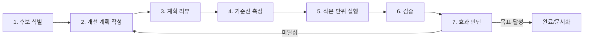

# Saturday Meetup 외부 인수인계 및 유지보수성 개선 계획

작성일: 2026-05-02

## 1. 목적

이 문서는 Saturday Meetup을 처음 보는 외부 개발사가 빠르게 구조를 이해하고, 안전하게 수정하고, 성능/사용성 개선 효과를 스스로 검증할 수 있게 만드는 실행 계획이다.

기존 `docs/development-improvement-plan.md`가 제품 기능 개선 백로그라면, 이 문서는 코드베이스 인수인계 품질과 유지보수성 개선에 초점을 둔다.

## 2. 현재 기준선

현재 레포는 Next.js App Router 기반 내부 운영 대시보드다. 기능은 이미 넓게 구현되어 있지만, 주요 화면과 서버 액션이 커지고 있고 DB 스키마 기준이 런타임 보정 로직과 문서로 나뉘어 있어 신규 개발자가 전체 흐름을 파악하기 어렵다.

확인된 기준선은 다음과 같다.

| 항목 | 현재 상태 | 근거 |
| --- | --- | --- |
| 프레임워크 | Next.js 16, React 19, TypeScript | `package.json` |
| 데이터 접근 | `pg` 직접 SQL, store 계층별 `ensure...Schema()` | `src/lib/db.ts`, `src/lib/*-store.ts` |
| 라우트 수 | `page.tsx` 35개 | `src/app/**/page.tsx` |
| 앱 파일 수 | `src/app` TS/TSX 64개 | `find src/app` |
| 도메인 파일 수 | `src/lib` TS/TSX 48개 | `find src/lib` |
| 큰 파일 | `actions.ts` 948줄, `meetup-dashboard.tsx` 1128줄, `afterparty/[id]/page.tsx` 1122줄 | `wc -l` |
| 단위 테스트 | 22개 파일, 186개 테스트 통과 | `npm run test` |
| E2E | Playwright spec 5개 | `e2e/*.spec.ts` |
| 정량 커버리지 | 없음 | `vitest.config.ts`에 coverage 미설정 |

## 3. 개선 원칙

1. 동작 보호가 먼저다. 정리 전 현재 동작을 테스트 또는 체크리스트로 잠근다.
2. 외부 개발자가 읽는 순서대로 문서를 만든다. 제품 개요, 실행법, 아키텍처, 데이터, 변경 절차 순서로 정리한다.
3. 한 번에 대형 리팩터링하지 않는다. 파일 분리, 중복 제거, 명명 정리, 테스트 보강을 작은 단위로 반복한다.
4. 성능과 사용성 개선은 측정 전후가 있어야 한다. 느낌만으로 성공 처리하지 않는다.
5. 새 의존성은 기본적으로 추가하지 않는다. 현재 스택 안에서 개선한다.

## 4. 반복 루프

각 개선 항목은 아래 루프를 통과해야 완료로 본다.

### 루프별 산출물

| 단계 | 산출물 | 완료 기준 |
| --- | --- | --- |
| 후보 식별 | 문제 위치, 영향 사용자, 근거 | 파일/화면/명령으로 재현 가능 |
| 개선 계획 | 어디서/어떻게/왜/검증 방법 | 구현자가 바로 작업 가능 |
| 계획 리뷰 | 리스크, 제외 범위, 대안 | 범위가 작고 되돌릴 수 있음 |
| 기준선 측정 | 테스트 결과, 성능 수치, 사용성 체크 | 개선 전 수치가 남아 있음 |
| 실행 | 작고 독립적인 diff | 한 smell 또는 한 사용자 흐름만 수정 |
| 검증 | lint/typecheck/test/build/E2E 결과 | 실패 시 다음 단계 금지 |
| 효과 판단 | 목표 대비 결과 | 효과 없으면 되돌리거나 계획 수정 |

## 5. 우선순위 1: 외부 개발자 온보딩 문서

### 어디서

- `README.md`
- 새 문서 후보: `docs/architecture.md`, `docs/data-model.md`, `docs/development-guide.md`, `docs/operations-runbook.md`

### 왜

현재 README는 제품 설명과 운영 흐름은 충분히 담고 있지만, 신규 개발자가 "어느 파일을 먼저 봐야 하는지", "기능을 수정할 때 어느 계층을 건드려야 하는지", "DB 스키마 기준을 무엇으로 봐야 하는지"를 빠르게 알기 어렵다.

### 어떻게

1. README를 외부 개발자 첫 진입용으로 재구성한다.
2. 아키텍처 문서를 추가해 `src/app`, `src/lib`, `scripts`, `e2e`, `docs/db`의 책임을 설명한다.
3. 주요 사용자 흐름별 코드 진입점을 표로 만든다.
4. DB 스키마 기준을 명확히 한다. 현재는 `docs/db/01_init_schema.sql`과 각 store의 `ensure...Schema()`가 함께 존재하므로, 어떤 상황에서 무엇을 신뢰해야 하는지 문서화한다.
5. 변경 절차를 문서화한다. 예: 모임 필드 추가, 뒷풀이 정산 변경, 주간 보고 필드 추가, 운영 단위 추가.

### 검증

- 외부 개발자가 README만 보고 로컬 실행, DB 연결 확인, 테스트 실행을 순서대로 따라 할 수 있어야 한다.
- `npm run db:ping`, `npm run typecheck`, `npm run lint`, `npm test` 절차가 문서에 있어야 한다.
- 문서에 나온 파일 경로가 실제로 존재해야 한다.

## 6. 우선순위 2: 서버 액션 분리

### 어디서

- `src/app/actions.ts`
- 후보 분리 위치:
  - `src/app/actions/auth-actions.ts`
  - `src/app/actions/meeting-actions.ts`
  - `src/app/actions/afterparty-actions.ts`
  - `src/app/actions/shared-form-utils.ts`

### 왜

`src/app/actions.ts`는 948줄이고 로그인, 모임, 뒷풀이, 정산, 참석자 파싱, redirect/revalidate 처리를 모두 포함한다. 외부 개발자는 한 기능을 고치기 위해 무관한 액션까지 함께 읽어야 한다.

### 어떻게

1. 먼저 `src/app/actions.ts`의 export 목록과 호출 위치를 문서화한다.
2. 동작 보호 테스트를 실행한다. 최소 `npm test`, 가능하면 모임/뒷풀이 E2E를 기준선으로 남긴다.
3. 공개 export 이름은 유지하고 내부 구현만 도메인별 파일로 이동한다.
4. 공통 form parsing, safe return path, feedback path 생성은 shared utility로 분리한다.
5. 분리 후 import 경로만 바뀌고 UI 동작은 그대로여야 한다.

### 검증

- `npm run typecheck`
- `npm run lint`
- `npm test`
- 모임 생성/참석/삭제, 뒷풀이 생성/정산/삭제 E2E 또는 수동 체크

### 성공 기준

- `src/app/actions.ts`가 재수출 또는 얇은 facade 수준으로 줄어든다.
- 도메인별 액션 파일이 300줄 이하를 목표로 한다.
- 신규 개발자가 모임 수정은 meeting actions, 뒷풀이는 afterparty actions로 바로 이동할 수 있다.

## 7. 우선순위 3: 큰 페이지 컴포넌트 분해

### 어디서

- `src/app/meetup-dashboard.tsx` 1128줄
- `src/app/afterparty/[afterpartyId]/page.tsx` 1122줄
- `src/app/afterparty/page.tsx` 615줄
- `src/app/admin/history/page.tsx`

### 왜

App Router 서버 컴포넌트 안에 데이터 로딩, 정렬, 표시 컴포넌트, form UI, 빈 상태, 오류 상태가 섞여 있다. 화면을 조금만 바꿔도 전체 파일을 이해해야 하고, 사용성 개선도 회귀 위험이 커진다.

### 어떻게

1. 파일별로 "서버 데이터 준비"와 "표시 컴포넌트"를 나눈다.
2. 화면 내부 helper 중 순수 함수는 `src/lib` 또는 같은 route의 `_components`/`components`로 이동한다.
3. 반복되는 카드, 칩, 상태 배지, empty state는 한 화면 안에서 먼저 추출한다.
4. 전역 공통 컴포넌트화는 두 화면 이상에서 실제 중복이 확인될 때만 한다.

### 검증

- 스냅샷 테스트보다 사용자 흐름 테스트를 우선한다.
- 모바일 폭에서 헤더/탭/카드/폼이 겹치지 않는지 Playwright screenshot 또는 수동 체크로 확인한다.
- 분해 후 `npm run build`로 서버 컴포넌트 import 오류를 잡는다.

### 성공 기준

- 한 파일이 한 화면의 orchestration 역할만 담당한다.
- 주요 하위 UI가 이름만 봐도 책임을 알 수 있다.
- 화면 수정 diff가 관련 컴포넌트에 국한된다.

## 8. 우선순위 4: 데이터 스키마와 마이그레이션 기준 정리

### 어디서

- `docs/db/01_init_schema.sql`
- `src/lib/meetup-store.ts`
- `src/lib/afterparty-store.ts`
- `src/lib/member-store.ts`
- `src/lib/weekly-report-store.ts`
- `src/lib/operating-unit-store.ts`
- `scripts/apply-schema.mjs`

### 왜

현재 store 계층은 `ensure...Schema()`로 런타임 스키마 보정을 수행한다. 운영 중 빠르게 진화한 내부 도구에는 실용적이지만, 외부 개발사가 새 환경을 구성하거나 스키마 변경을 리뷰할 때 기준이 분산되어 보인다.

### 어떻게

1. 현재 운영 스키마의 canonical source를 결정한다.
2. 런타임 보정은 유지하되, 신규 DB 생성 기준은 `docs/db/01_init_schema.sql`로 명시한다.
3. 스키마 변경 절차를 문서화한다.
   - SQL 문서 갱신
   - store의 보정 로직 갱신
   - 백업/검증 명령 실행
   - 관련 테스트 추가
4. `ensure...Schema()`는 성능 병목이 되지 않도록 최초 1회만 실행되는지 확인한다.

### 검증

- 빈 DB에 `node scripts/apply-schema.mjs --env-file .env.local --verify-only` 또는 적용 검증을 수행한다.
- 기존 DB에서 앱이 정상 기동하는지 확인한다.
- 스키마 변경 관련 테스트가 통과해야 한다.

### 성공 기준

- 외부 개발사가 "스키마를 바꾸려면 어떤 파일을 같이 바꿔야 하는지"를 문서만 보고 알 수 있다.
- 신규 환경 재현과 기존 환경 보정의 책임이 분리되어 설명된다.

## 9. 우선순위 5: 성능 병목 측정과 개선

### 어디서

- `src/lib/cached-queries.ts`
- `src/lib/history-store.ts`
- `src/lib/meetup-store.ts`
- `src/lib/afterparty-store.ts`
- `e2e/performance.spec.ts`
- 목록 화면: `/`, `/loop-pak`, `/afterparty`, `/admin/history`

### 왜

현재 캐시는 `unstable_cache`와 tag invalidation으로 구성되어 있다. 병목은 추측으로 고칠 수 없으므로, 목록 조회/히스토리 조회/뮤테이션 후 재조회 시간을 먼저 측정해야 한다.

### 어떻게

1. 성능 기준선을 남긴다.
   - TTFB: 스터디, 뒷풀이, 히스토리 화면
   - mutation 후 첫 화면 갱신 시간
   - DB 쿼리 수 또는 느린 쿼리 후보
2. `e2e/performance.spec.ts`가 실제 운영 데이터에 쓰기 작업을 하지 않도록 별도 테스트 환경을 기본값으로 바꾼다.
3. 히스토리/참여자 조회에서 N+1 또는 불필요한 다중 조회가 있는지 확인한다.
4. 캐시 tag 범위가 너무 넓어 불필요한 invalidation이 일어나는지 확인한다.

### 검증

- 개선 전후 성능 수치를 같은 환경에서 비교한다.
- 목표 예시:
  - 주요 목록 TTFB 20% 이상 개선 또는 p95 1초 이하
  - mutation 후 화면 반영 오류 0건
  - 캐시 비활성화 시에도 기능 정상

### 성공 기준

- 성능 개선 PR에는 반드시 "전/후 수치"가 포함된다.
- 수치 개선이 없으면 리팩터링만 남기지 않고 원인을 기록하거나 되돌린다.

## 10. 우선순위 6: 사용성 개선

### 어디서

- 모바일 헤더/탭: `src/app/dashboard-header.tsx`, `src/app/role-shell.tsx`
- 참여자 추가/피드백: `src/app/actions.ts`, 모임 상세/뒷풀이 상세
- 정산 토글: `src/app/afterparty/[afterpartyId]/settlement-toggle.tsx`
- 멤버 저장: `src/app/members/*`
- 엔젤 보고: `src/app/angel/reports/**`

### 왜

현장 운영 도구는 입력 속도와 실수 복구가 중요하다. 기능이 많아지면서 모바일 화면, 실패 피드백, 저장 상태, 정산 확인 흐름이 복잡해질 가능성이 크다.

### 어떻게

1. 모바일 우선 체크리스트를 만든다.
2. 주요 업무별 클릭 수를 측정한다.
   - 모임 참석자 추가
   - 뒷풀이 참여자 추가
   - 정산 완료 토글
   - 엔젤 보고 제출
3. 오류 상태를 분류한다.
   - 인증 만료
   - 중복 참여자
   - 대기 불가
   - 저장 실패
   - 권한 없음
4. 각 오류가 화면에서 사용자가 다음 행동을 알 수 있게 표현되는지 확인한다.

### 검증

- 모바일 viewport Playwright screenshot 또는 수동 체크
- E2E로 핵심 업무 완료 여부 확인
- 사용성 개선 전후 클릭 수 또는 입력 단계 수 비교

### 성공 기준

- 주요 업무가 모바일에서도 겹침 없이 완료된다.
- 실패 후 사용자가 같은 입력을 처음부터 다시 하지 않아도 된다.
- 개선 결과가 `docs/qa/mobile-checklist.md` 또는 별도 QA 문서에 기록된다.

## 11. 우선순위 7: 테스트 체계와 커버리지 가시화

### 어디서

- `vitest.config.ts`
- `package.json`
- `e2e/*.spec.ts`
- `scripts/quality-harness.mjs`

### 왜

단위 테스트는 이미 186개가 통과하지만, 정량 커버리지 리포트가 없어 외부 개발사가 어떤 영역이 보호되는지 파악하기 어렵다. E2E도 기본 baseURL이 운영 유사 URL이어서 안전한 실행 기준을 더 명확히 해야 한다.

### 어떻게

1. 커버리지 리포트 도입 여부를 결정한다. 새 의존성이 필요하므로 별도 승인 또는 명시 계획이 있어야 한다.
2. 의존성 추가 없이 먼저 테스트 맵 문서를 만든다.
   - store 테스트
   - action 테스트
   - route/utility 테스트
   - E2E 시나리오
3. E2E 실행 환경을 분리한다.
   - 로컬 또는 staging DB만 쓰기 테스트 허용
   - production-like URL 보호 유지
4. `quality:harness` 결과를 외부 개발사 PR 체크 기준으로 문서화한다.

### 검증

- `npm run typecheck`
- `npm run lint`
- `npm test`
- `npm run build`
- 안전한 target에서 `RUN_E2E=1 npm run quality:harness`

### 성공 기준

- 외부 개발사가 변경 종류별로 어떤 테스트를 돌려야 하는지 안다.
- E2E가 운영 데이터를 실수로 오염시키지 않는다.

## 12. 계획 리뷰 체크리스트

각 개선 계획은 실행 전 아래 질문에 답해야 한다.

| 질문 | 통과 기준 |
| --- | --- |
| 어디를 고치는가? | 파일/화면/함수가 특정되어 있다 |
| 왜 고치는가? | 신규 개발자 이해, 성능, 사용성, 안정성 중 하나에 직접 연결된다 |
| 어떻게 고치는가? | 작은 단계로 나뉘어 있고 되돌릴 수 있다 |
| 무엇을 보존하는가? | 기존 사용자 플로우와 데이터 보존 기준이 명시되어 있다 |
| 어떻게 검증하는가? | 실행할 명령과 수동/E2E 체크가 정해져 있다 |
| 효과를 어떻게 판단하는가? | 전후 비교 기준이 있다 |
| 실패하면 어떻게 하는가? | 되돌림, 범위 축소, 재계획 기준이 있다 |

## 13. 첫 실행 권장 순서

1. 운영 단위 기본값 제거
   - 데이터 범위와 캐시 정확도에 직접 영향을 주므로 가장 먼저 정리한다.
2. E2E URL/날짜/운영 단위 상수 분리
   - 운영 단위 기본값 제거 후 테스트 유지 비용을 낮춘다.
3. 온보딩 문서 정리
   - 외부 개발사가 레포를 읽는 데 즉시 도움이 되고 리스크가 낮다.
4. 테스트/품질 게이트 문서화
   - 이후 리팩터링의 안전망을 명확히 한다.
5. 날짜/정렬/locale 하드코딩 제거
   - 이미 `app-config.ts`가 있으므로 화면별 직접 문자열을 공통 유틸로 모은다.
6. `actions.ts` 도메인별 분리
   - 변경 빈도가 높은 서버 액션의 이해 비용을 낮춘다.
7. 큰 페이지 컴포넌트 분해
   - 사용성 개선과 화면 변경을 쉽게 만든다.
8. 스키마 기준 정리
   - 외부 개발사가 DB 변경을 안전하게 리뷰할 수 있게 한다.
9. 성능/사용성 측정 후 개선
   - 병목 추측을 줄이고 실제 효과가 있는 작업만 남긴다.

## 14. 추가 검토 반영: 운영 단위와 하드코딩 제거

다른 모델이 제안한 4개 개선 축은 코드 기준으로 대부분 타당하다. 특히 운영 단위 기본값과 E2E URL 반복은 실제 변경 리스크와 유지보수 비용이 크므로 본 계획의 최우선 실행 항목으로 편입한다.

### 14.1 운영 단위 default 제거

#### 확인된 근거

- `loop-pak-3`은 더 이상 "기본 운영 단위"가 아니라 기존 `3기` 데이터를 이관한 명시 운영 단위다.
- `src/lib/operating-unit-store.ts`는 `null`, 빈 문자열, `default`, `3기`만 `loop-pak-3`으로 마이그레이션하고, 새 write path는 운영 단위 누락 시 실패한다.
- `src/lib/meetup-store.ts`, `src/lib/afterparty-store.ts`, `src/lib/member-store.ts`, `src/lib/history-store.ts`는 조회와 생성 경계에서 운영 단위를 명시 인자로 받는다.
- `cachedListMeetings*`, `cachedLoadMemberPreset`, `cachedListAfterparties*`, attendance cache key는 운영 단위를 포함한다.
- `docs/db/01_init_schema.sql`과 런타임 schema 생성은 `operating_unit_slug` 컬럼에 DB default를 두지 않는다.

#### 왜 필요한가

운영 단위가 제품의 핵심 경계가 되었는데 신규 데이터가 암묵적으로 `loop-pak-3`에 들어가면 새 기수/새 커리큘럼 운영 시 데이터 오염이 발생할 수 있다. 외부 개발사 입장에서도 "unit을 넘기지 않으면 어디에 저장되는지"가 코드마다 다르면 버그를 만들기 쉽다.

#### 어떻게 진행할 것인가

1. 기존 데이터 마이그레이션 기준을 먼저 문서화한다.
   - `null`, 빈 문자열, `default`, `3기`만 `loop-pak-3`로 이동한다.
   - 이미 명시된 다른 운영 단위는 절대 변경하지 않는다.
2. store API를 운영 단위 명시형으로 바꾼다.
   - 예: `listMeetingsByKind(kind, unitSlug)`, `loadMemberPreset(unitSlug)`, `listAfterpartiesByDate(date, unitSlug)`.
   - 생성 함수는 `operatingUnitSlug` 누락 시 에러를 내도록 바꾼다.
3. DB column default를 제거한다.
   - `alter table ... alter column operating_unit_slug drop default`.
   - 신규 DB SQL에서도 default를 제거한다.
4. 캐시 key와 tag 전략을 운영 단위 포함형으로 바꾼다.
   - key: `["listMeetingsByKind", unitSlug, meetingKind]`.
   - invalidation은 전체 tag 유지와 unit-scoped tag 도입 중 효과를 측정해 선택한다.
5. UI route에서 `unit`이 없는 legacy 경로는 읽기 전용 호환 또는 명시 redirect 정책을 정한다.

#### 검증

- 운영 단위가 다른 테스트 fixture 2개를 만들어 캐시가 섞이지 않는지 확인한다.
- 기존 `/cohorts/loop-pak-3/...` 플로우가 그대로 동작해야 한다.
- `unit` 없는 생성 요청은 명확히 실패해야 한다.
- `npm run typecheck`, `npm run lint`, `npm test`, 운영 단위 관련 E2E 통과.

### 14.2 E2E URL 상수 분리

#### 확인된 근거

- `e2e/cache-consistency.spec.ts`, `e2e/regression-meeting-flow.spec.ts`, `e2e/regression-afterparty-flow.spec.ts`, `e2e/performance.spec.ts`, `e2e/regression-history-dashboard.spec.ts`에 `loop-pak-3`와 `/cohorts/...` URL 패턴이 반복된다.
- `TEST_DATE`도 파일별로 흩어져 있어 날짜 변경 시 여러 파일을 수정해야 한다.

#### 왜 필요한가

운영 단위 default 제거 후 E2E는 명시 운영 단위를 계속 써야 한다. URL 상수가 흩어져 있으면 실제 테스트 대상 변경과 단순 문자열 수정이 섞여 회귀가 생긴다.

#### 어떻게 진행할 것인가

1. `e2e/support/test-config.ts`를 만든다.
2. 다음 값을 한 곳에 모은다.
   - `TEST_OPERATING_UNIT_SLUG`
   - `TEST_DATE`
   - `cohortPath(section, params)`
   - `waitForCohortUrl(section)`
3. 각 spec의 직접 URL 문자열을 helper 호출로 교체한다.
4. 성능 테스트의 쓰기 시나리오가 production-like URL에서 돌지 않도록 guard를 강화한다.

#### 검증

- `npx playwright test --list`로 spec discovery 확인.
- 안전한 로컬/staging target에서 회귀 spec을 실행한다.
- 문자열 교체만 한 커밋에서는 앱 코드 diff가 없어야 한다.

### 14.3 날짜, locale, 정렬 하드코딩 제거

#### 확인된 근거

- `src/lib/app-config.ts`에 `APP_LOCALE`, `APP_TIME_ZONE`이 이미 있다.
- 그런데 `meetup-dashboard.tsx`, `meetings/[meetingId]/page.tsx`, `afterparty/page.tsx`, `afterparty/[afterpartyId]/page.tsx`, `admin/reports/...`, `angel/reports/...`에서 `"ko"`, `"ko-KR"`, `"Asia/Seoul"`을 직접 사용한다.
- 참여자 정렬과 팀 라벨 정렬 로직이 여러 화면에 반복된다.

#### 왜 필요한가

정렬/날짜/locale은 화면 전체의 일관성을 만든다. 외부 개발사가 화면을 추가할 때 직접 `localeCompare(..., "ko")`를 복사하면 정렬 기준이 분산되고 테스트하기 어렵다.

#### 어떻게 진행할 것인가

1. `src/lib/sort-utils.ts`를 기준 정렬 API로 확장한다.
   - 이름 정렬
   - 팀 라벨 정렬
   - 날짜/시간 내림차순 정렬
2. 날짜 표시 유틸을 정리한다.
   - `APP_LOCALE`, `APP_TIME_ZONE`만 사용한다.
   - 화면별 `toLocaleString("ko-KR")` 직접 사용을 제거한다.
3. 참여자 그룹/정렬/표시 이름 계산을 순수 함수로 분리한다.
   - 모임 상세
   - 뒷풀이 상세
   - 대시보드 카드
4. 기존 정렬 결과를 테스트로 잠근 뒤 교체한다.

#### 검증

- `src/lib/sort-utils.test.ts`에 팀/이름/역할 정렬 케이스 추가.
- 참여자 표시 순서가 기존 화면과 달라지지 않는지 E2E 또는 화면 체크.
- locale/timezone 직접 문자열 검색 결과가 허용된 파일만 남아야 한다.

### 14.4 큰 파일 분리와 컴포저블 정리

#### 확인된 근거

- `src/app/meetup-dashboard.tsx` 1128줄
- `src/app/meetings/[meetingId]/page.tsx`도 참여자 정렬/표시/폼 책임이 크다.
- `src/app/afterparty/[afterpartyId]/page.tsx` 1122줄
- `src/app/members/member-admin-form.tsx`는 멤버/팀/역할 편집 상태를 크게 들고 있다.

#### 왜 필요한가

외부 개발사가 화면 단위 수정만 하려 해도 데이터 로딩, 정렬, form mutation, UI 표시를 한 파일에서 모두 읽어야 한다. 성능/사용성 개선도 파일 분리 없이는 회귀 검토 비용이 높다.

#### 어떻게 진행할 것인가

1. 순수 함수부터 분리한다.
   - 참여자 정렬
   - 참여자 그룹핑
   - 정산 완료 계산
   - form feedback path 계산
2. route-local component를 만든다.
   - `src/app/meetings/[meetingId]/_components/*`
   - `src/app/afterparty/[afterpartyId]/_components/*`
   - `src/app/members/_components/*`
3. 서버 데이터 로딩은 page에 남기고, 표시 컴포넌트는 props 기반으로 분리한다.
4. 한 번에 공통 디자인 시스템을 만들지 않는다. 두 화면 이상에서 반복이 확인된 것만 공통화한다.

#### 검증

- 분리 전후 `npm run build` 통과.
- 기존 테스트가 모두 통과.
- 모임 상세/뒷풀이 상세/멤버 관리의 핵심 조작을 수동 또는 E2E로 확인.
- 파일 분리 후 한 파일의 책임이 설명 가능한 수준인지 리뷰한다.

### 14.5 남은 성능 병목

#### 확인된 근거

외부 분석에서 다음 첫 요청 병목이 보고되었다.

- `/cohorts/loop-pak-3/afterparty?date=...` 첫 요청 약 1.53s
- `/cohorts/loop-pak-3/angel/reports` 첫 요청 약 1.41s

현재 코드 기준으로 뒷풀이 목록은 `listAfterpartiesByDate()`에서 lateral subquery로 settlement/participant count를 계산하고, 엔젤 보고는 cycle/team/submission overview를 조합한다. 첫 요청 병목 후보로 타당하다.

#### 왜 필요한가

warm cache가 개선되어도 첫 요청이 느리면 현장 운영자가 날짜를 바꾸거나 새 화면을 처음 열 때 체감이 나쁘다. 다만 성능은 추측으로 고치면 위험하므로 쿼리 프로파일링을 먼저 해야 한다.

#### 어떻게 진행할 것인가

1. 성능 테스트에 엔젤 보고 URL을 추가한다.
2. 뒷풀이 초기 조회 쿼리를 프로파일링한다.
   - `EXPLAIN ANALYZE`
   - participant/settlement count lateral subquery 비용 확인
   - 날짜+운영 단위 index 사용 여부 확인
3. 엔젤 보고 overview 쿼리를 프로파일링한다.
   - cycle 조회
   - 팀 목록 조회
   - report/comment count 집계 비용 확인
4. 쿼리 개선은 한 후보씩 적용한다.
   - 필요한 index 추가
   - count 집계 query 병합
   - 불필요한 전체 cycle 조회 제한
5. 전후 수치를 같은 환경에서 비교한다.

#### 검증

- cold/warm TTFB 전후 비교.
- query plan 저장.
- 기능 회귀 테스트 통과.
- 개선이 10% 미만이면 성능 개선으로 주장하지 않고 유지보수성 개선 여부만 따로 판단한다.

## 15. 완료 정의

전체 개선 루프의 완료는 다음 조건을 만족해야 한다.

- 외부 개발자가 문서만 보고 로컬 실행, DB 연결 확인, 테스트 실행을 할 수 있다.
- 주요 기능별 코드 진입점이 문서화되어 있다.
- 큰 파일 또는 책임이 큰 파일의 분리 계획이 실행되었거나 명확한 후속 티켓으로 남아 있다.
- lint, typecheck, unit test, build가 통과한다.
- E2E는 안전한 환경에서 실행하는 방법이 문서화되어 있다.
- 성능/사용성 개선은 전후 수치 또는 체크리스트 결과로 효과가 확인된다.
- 효과가 없었던 개선은 이유와 함께 되돌리거나 다음 계획에 반영한다.
