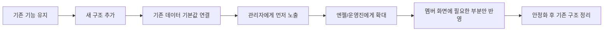
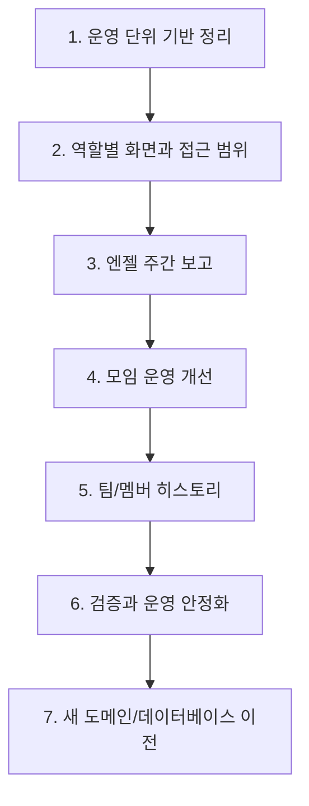
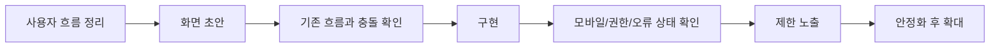

# Saturday Meetup 기능 추가 작업계획서

작성일: 2026-04-27

## 1. 목표

현재 오프라인 모임 대시보드를 4기 이후에도 재사용할 수 있는 운영 도구로 확장한다.

핵심 목표는 다음과 같다.

- 기수와 커리큘럼별로 데이터를 나누어 관리한다.
- 멤버, 엔젤, 관리자 화면을 역할에 맞게 분리한다.
- 엔젤 주간 보고를 제품 안에서 작성하고 취합한다.
- 팀/멤버 참여 흐름을 기간별로 확인한다.
- 모임 모집 인원, 장소 안내, 공유 기능을 개선한다.
- 모든 기능 검증 후 현재 사용 중인 도메인과 데이터베이스를 새 환경으로 이전한다.

## 2. 범위

### 포함

- 기수/커리큘럼 운영 단위 관리
- 역할별 화면 분리
- 엔젤 주간 보고 관리
- 팀/멤버 히스토리 대시보드
- 모임 모집 인원과 대기 인원 관리
- 모임 장소 지도 미리보기
- 모임 공유용 문구 생성
- 새 도메인과 새 데이터베이스로 최종 이전

### 제외

- 매주 반복 모임 자동 생성
- 멘토링 시간 공지 자동화
- 오프라인/온라인 팀 매칭 자동화
- 젭 팀 장소 안내 자동화
- 슬랙 자동 전송

슬랙은 우선 자동 전송이 아니라, 복사해서 붙여넣을 수 있는 공유용 문구 생성까지를 1차 범위로 둔다.

## 3. 작업 원칙

- 현재 운영 중인 데이터는 기능 개발 중 삭제하거나 덮어쓰지 않는다.
- 현재는 개발 환경과 운영 환경이 명확히 분리되어 있지 않으므로, 기존 기능과 호환되는 방식으로만 변경한다.
- 새 기능은 가능하면 별도 검증 환경에서 먼저 확인한다. 별도 환경이 준비되기 전에는 기능을 숨긴 상태로 배포하고 내부에서만 확인한다.
- 현재 도메인과 데이터베이스 이전은 모든 기능 개발과 검증이 끝난 뒤 마지막 단계에서 진행한다.
- 기존 모임/뒷풀이 사용 흐름은 최대한 유지한다.
- 멤버가 쓰는 화면은 단순하게 유지하고, 복잡한 운영 기능은 엔젤/관리자 화면에 둔다.

## 4. 호환성 유지 전략

### 기본 방향

기존 기능을 한 번에 새 구조로 바꾸지 않는다. 새 구조를 기존 기능 옆에 붙이고, 충분히 확인한 뒤 화면과 데이터를 조금씩 옮긴다.

이 방식은 strangler 패턴으로 진행한다. 기존 대시보드를 당장 제거하지 않고, 새 기능이 안정화될 때까지 기존 화면과 새 화면을 함께 둔다.

### 적용 원칙

- 기존 URL과 기존 화면은 유지한다.
- 기존 데이터 구조를 바로 삭제하거나 이름을 바꾸지 않는다.
- 데이터베이스 변경은 새 테이블 또는 새 컬럼을 추가하는 방식으로 시작한다.
- 새 컬럼은 기본값을 두어 기존 데이터가 계속 동작하게 한다.
- 새 기능은 기능 스위치로 숨기거나 관리자 화면에서만 먼저 노출한다.
- 새 기능이 안정화되기 전까지 기존 흐름으로 되돌아갈 수 있게 한다.
- 삭제 작업은 마지막 단계까지 미룬다.

### 단계별 전환 방식

### 기능별 호환 전략

| 기능 | 호환 전략 |
| --- | --- |
| 운영 단위 관리 | 기존 데이터는 기본 운영 단위에 자동 연결하고, 운영 단위 선택이 없어도 기존 화면은 그대로 동작 |
| 역할별 화면 | 기존 공용 대시보드는 유지하고, 멤버/엔젤/관리자 화면을 새 진입점으로 추가 |
| 엔젤 주간 보고 | 기존 슬랙 보고 흐름은 유지하고, 제품 안 보고 기능은 병행 사용부터 시작 |
| 모집 인원 관리 | 정원을 설정한 모임에만 대기 인원 기능 적용, 정원이 없는 기존 모임은 기존 참석 방식 유지 |
| 장소 안내 개선 | 기존 지도 링크는 유지하고, 지도 미리보기는 가능한 경우에만 추가 표시 |
| 모임 공유 기능 | 기존 공유/복사 흐름은 유지하고, 새 공유 문구 버튼을 추가 |
| 히스토리 대시보드 | 기존 데이터를 읽어 요약하는 화면으로 시작하고, 기존 입력 흐름은 변경하지 않음 |

### 배포 전 확인 기준

- 기존 대시보드에서 모임 조회가 가능하다.
- 기존 방식으로 참석자 추가/삭제가 가능하다.
- 기존 방식으로 뒷풀이 참여자와 정산 상태를 관리할 수 있다.
- 운영 단위가 없는 기존 데이터도 기본 운영 단위로 정상 표시된다.
- 새 기능을 숨겨도 기존 사용자는 영향을 받지 않는다.

## 5. 전체 일정 흐름

## 6. 실행 팀 구성

### 기본 방향

이번 작업은 기능만 추가하면 되는 작업이 아니다. 멤버, 엔젤, 관리자 사용 흐름이 모두 달라지므로 구현과 동시에 사용자 흐름, 화면 사용성, 디자인 일관성, 검증을 함께 봐야 한다.

### 권장 역할

| 역할 | 담당 |
| --- | --- |
| 제품/요구사항 담당 | 기능 범위, 우선순위, 운영 정책, 제외 범위 정리 |
| 사용자 흐름 담당 | 멤버/엔젤/관리자별 사용 흐름, 화면 진입점, 권한 경계 정리 |
| 화면/디자인 담당 | 화면 구조, 입력 흐름, 모바일 사용성, 안내 문구, 빈 상태/오류 상태 정리 |
| 구현 담당 | 데이터 구조, 서버 로직, 화면 구현, 기존 기능 호환성 유지 |
| 검증 담당 | 기존 기능 회귀 확인, 역할별 접근 확인, 운영 데이터 영향 확인 |
| 이전 담당 | 새 데이터베이스, 새 도메인, 백업, 리허설, 전환 계획 관리 |

### 단계별 협업 방식

- 각 기능은 구현 전에 사용자 흐름을 먼저 정리한다.
- 멤버 화면은 최대한 단순하게 유지한다.
- 엔젤 화면은 보고 작성과 댓글 작성이 빠르게 끝나도록 구성한다.
- 관리자 화면은 제출 현황, 미처리 항목, 운영 단위 전환이 한눈에 보이도록 구성한다.
- 새 화면은 모바일에서 먼저 깨지지 않는지 확인한다.
- 기능 구현 후에는 구현 담당만 확인하지 않고, 사용자 흐름 담당과 검증 담당이 함께 확인한다.

### 화면 사용성 검토 기준

- 사용자가 다음에 무엇을 해야 하는지 바로 알 수 있는가?
- 멤버가 관리자용 기능을 보지 않는가?
- 엔젤이 보고 작성 화면까지 쉽게 들어갈 수 있는가?
- 관리자가 미제출 보고와 대기 인원을 빠르게 찾을 수 있는가?
- 입력 실패, 저장 실패, 권한 없음 상태가 이해하기 쉽게 표시되는가?
- 모바일 화면에서 버튼과 텍스트가 겹치지 않는가?
- 새 기능이 기존 모임/뒷풀이 흐름을 방해하지 않는가?

### UX 검토 게이트

각 기능은 아래 순서를 통과한 뒤 다음 단계로 넘어간다.

## 7. 1단계. 운영 단위 기반 정리

### 목표

3기, 4기, 커리어 프레임워크 등 운영 단위별로 데이터를 나누어 관리할 수 있게 한다.

### 작업

- 운영 단위 개념 추가
- 기존 데이터를 기본 운영 단위에 연결
- 운영 단위가 없는 데이터도 기존 화면에서 계속 보이도록 처리
- 운영 단위별 멤버, 팀, 엔젤 관리
- 운영 단위별 오프라인 모임과 뒷풀이 조회
- 관리자 화면에 운영 단위 선택 기능을 먼저 추가
- 안정화 후 멤버/엔젤 화면에도 필요한 범위만 반영
- 운영 단위 선택 화면의 기본값, 빈 상태, 잘못 선택했을 때의 안내 문구 정리

### 완료 기준

- 기존 3기 데이터가 보존된다.
- 4기 또는 커리어 프레임워크 운영 단위를 새로 만들 수 있다.
- 운영 단위를 바꾸면 해당 단위의 멤버, 팀, 모임, 뒷풀이만 보인다.
- 기존 대시보드 사용 흐름이 깨지지 않는다.
- 운영 단위 기능을 숨겨도 기존 화면은 정상 동작한다.
- 관리자가 현재 보고 있는 운영 단위를 명확히 알 수 있다.

## 8. 2단계. 역할별 화면과 접근 범위

### 목표

멤버, 엔젤, 관리자에게 필요한 화면을 분리한다.

### 화면 구분

| 화면 | 주 사용자 | 주요 기능 |
| --- | --- | --- |
| 멤버 화면 | 멤버 | 모임 확인, 참석 등록, 뒷풀이 참여 |
| 엔젤 화면 | 엔젤, 서포터, 운영진 | 모임 확인, 담당 팀 보고 작성, 댓글 작성 |
| 관리자 화면 | 관리자 | 운영 단위 관리, 멤버/팀/엔젤 관리, 보고 요청 관리, 제출 현황 확인 |
| 공용 모임 화면 | 전체 사용자 | 오프라인 모임, 뒷풀이, 장소, 참여 현황 확인 |

### 작업

- 사용자 역할 구분 방식 정리
- 기존 공용 대시보드는 유지
- 역할별 진입 화면을 새로 추가
- 멤버가 엔젤 보고와 관리자 영역을 볼 수 없도록 분리
- 엔젤과 운영진은 모임/뒷풀이 접근 가능 유지
- 관리자는 모든 운영 정보를 볼 수 있도록 구성
- 역할별 첫 화면에서 가장 중요한 작업을 먼저 배치

### 완료 기준

- 멤버는 모임과 뒷풀이 중심 화면만 본다.
- 엔젤은 담당 팀 보고 화면에 접근할 수 있다.
- 관리자는 보고 요청, 제출 현황, 운영 단위 관리를 할 수 있다.
- 역할별 접근 범위가 명확하다.
- 기존 공용 대시보드는 계속 사용할 수 있다.
- 각 역할의 첫 화면에서 핵심 작업까지 이동 경로가 짧다.

## 9. 3단계. 엔젤 주간 보고 관리

### 목표

슬랙과 줌 회의에 흩어지는 엔젤 주간 보고를 주차별로 작성, 확인, 취합할 수 있게 한다.

### 작업

- 운영 단위와 주차 기준 보고 요청 생성
- 주차별 보고 양식 생성
- 엔젤별 담당 팀 보고 작성
- 보고에 댓글 또는 추가 의견 작성
- 관리자 제출 현황 확인
- 슬랙 공유용 문구 생성
- 초기에는 기존 슬랙 보고 방식과 병행 운영
- 보고 작성 중 임시 저장, 제출 완료, 수정 상태를 명확히 표시
- 관리자가 미제출 팀과 최근 댓글을 빠르게 볼 수 있도록 구성

### 기본 보고 항목

- 이번 주 팀 분위기
- 오프라인 모임 참여 현황
- 뒷풀이 참여 여부와 특이사항
- 도움이 필요해 보이는 멤버
- 잘하고 있거나 눈에 띄는 멤버
- 운영진에게 전달할 건의사항
- 다음 주에 챙기면 좋을 일

### 완료 기준

- 관리자는 주차별 보고 요청을 만들 수 있다.
- 엔젤은 담당 팀 보고를 작성하고 수정할 수 있다.
- 관리자는 제출/미제출 상태를 한눈에 확인할 수 있다.
- 관리자는 보고 내용을 슬랙 공유용 문구로 복사할 수 있다.
- 제품 안 보고 기능을 쓰지 않아도 기존 슬랙 보고 흐름은 유지된다.
- 엔젤이 보고 작성 화면에서 무엇을 입력해야 하는지 쉽게 이해할 수 있다.

## 10. 4단계. 모임 운영 개선

### 목표

오프라인 모임 운영 중 반복되는 안내와 인원 확인 작업을 줄인다.

### 4-1. 모집 인원 관리

작업:

- 모임별 모집 인원 설정
- 참석 확정 인원과 대기 인원 구분
- 정원 초과 시 대기 인원으로 등록
- 관리자가 대기 인원을 참석자로 전환

완료 기준:

- 모임별 정원을 설정할 수 있다.
- 정원을 넘은 신청자는 대기 상태로 구분된다.
- 운영자는 참석 확정 인원과 대기 인원을 따로 볼 수 있다.
- 정원이 없는 기존 모임은 기존 참석 방식으로 동작한다.
- 참석 확정/대기 상태가 화면에서 헷갈리지 않게 구분된다.

### 4-2. 장소 안내 개선

작업:

- 기존 지도 링크 유지
- 가능한 경우 모임 상세 화면에서 지도 미리보기 표시
- 지도 미리보기가 어려운 경우 기존처럼 지도 보기 버튼 제공
- 주소 복사 또는 지도 링크 복사 버튼 검토

완료 기준:

- 모임 상세에서 장소를 더 쉽게 확인할 수 있다.
- 지도 미리보기가 실패해도 기존 링크 이동은 유지된다.
- 지도 미리보기와 지도 보기 버튼이 모바일에서도 잘 보인다.

### 4-3. 모임 공유 기능

작업:

- 모임 날짜, 시간, 장소, 지도 링크, 참여 링크를 포함한 공유용 문구 생성
- 슬랙/카카오톡에 붙여넣기 좋은 형태로 복사
- 뒷풀이 정보가 있으면 함께 포함

완료 기준:

- 운영자가 모임 공유 문구를 한 번에 복사할 수 있다.
- 공지 작성 시 반복 복사 작업이 줄어든다.
- 복사 성공/실패 상태가 사용자에게 표시된다.

## 11. 5단계. 팀/멤버 히스토리 대시보드

### 목표

특정 주차만 보는 것이 아니라, 기간별로 팀과 멤버의 참여 흐름을 확인할 수 있게 한다.

### 작업

- 기간 선택
- 팀별 오프라인 모임 참여율 표시
- 멤버별 오프라인 모임 참석 횟수 표시
- 멤버별 뒷풀이 참석 횟수 표시
- 팀/멤버별 참여 흐름을 표 또는 그래프로 표시
- 엔젤 보고 제출 여부와 연결 검토

### 완료 기준

- 관리자는 기간별 팀 참여 흐름을 확인할 수 있다.
- 관리자는 멤버별 참석 횟수를 확인할 수 있다.
- 표나 그래프로 흐름을 빠르게 파악할 수 있다.
- 기존 참석 입력 방식은 변경하지 않는다.
- 숫자와 그래프가 과하게 복잡하지 않고, 운영자가 바로 해석할 수 있다.

## 12. 6단계. 검증과 운영 안정화

### 목표

기능 개발 후 실제 운영에 올리기 전에 안전하게 검증한다.

### 작업

- 기존 모임/뒷풀이 흐름 회귀 테스트
- 운영 단위별 데이터 분리 확인
- 역할별 접근 범위 확인
- 엔젤 보고 작성/제출/취합 확인
- 모집 인원과 대기 인원 흐름 확인
- 지도 미리보기 실패 시 링크 이동 유지 확인
- 공유 문구 복사 확인
- 팀/멤버 히스토리 수치 확인
- 새 기능 숨김 상태에서 기존 화면 정상 동작 확인
- 새 기능 노출 상태에서 관리자/엔젤/멤버 흐름 확인
- 모바일 화면에서 주요 흐름 확인
- 빈 상태, 오류 상태, 권한 없음 상태 확인

### 완료 기준

- 기존 기능이 깨지지 않는다.
- 새 기능의 핵심 흐름이 검증된다.
- 운영 데이터에 영향을 주지 않는 검증 환경에서 확인이 끝난다.
- 관리자, 엔젤, 멤버 관점의 주요 화면을 모두 확인한다.
- 기존 기능으로 되돌릴 수 있는 경로가 남아 있다.
- 사용자 흐름과 화면 사용성 검토가 끝난다.

## 13. 7단계. 새 도메인과 새 데이터베이스 이전

### 목표

모든 기능 개발과 검증이 끝난 뒤, 현재 사용 중인 도메인과 데이터베이스를 새 환경으로 이전한다.

### 이전 원칙

- 기능 개발 중에는 현재 운영 데이터베이스를 직접 이전하지 않는다.
- 새 데이터베이스에 먼저 구조를 만들고 검증한다.
- 기존 데이터는 백업 후 이전한다.
- 이전 전후 데이터 개수와 주요 화면을 비교한다.
- 문제가 생기면 기존 도메인과 데이터베이스로 되돌릴 수 있게 한다.
- 최종 이전 전까지 기존 도메인은 계속 사용 가능해야 한다.

### 데이터베이스 이전 작업

1. 현재 데이터베이스 백업
2. 새 데이터베이스 생성
3. 최신 데이터베이스 구조 적용
4. 기존 데이터 내보내기
5. 새 데이터베이스로 데이터 가져오기
6. 운영 단위 연결 상태 확인
7. 모임, 뒷풀이, 멤버, 엔젤, 보고 데이터 개수 비교
8. 새 데이터베이스 기준으로 전체 화면 확인

### 도메인 이전 작업

1. 새 도메인 또는 새 배포 주소 준비
2. 앱 환경변수에 새 기본 주소 반영
3. 공유 링크와 로그인 흐름 확인
4. 새 도메인에서 관리자/엔젤/멤버 화면 확인
5. 최종 전환 시점 확정
6. 도메인 연결 전환
7. 전환 후 주요 기능 확인
8. 필요하면 기존 도메인에서 새 도메인으로 안내 또는 리다이렉트 설정

### 완료 기준

- 새 데이터베이스에서 모든 기능이 정상 동작한다.
- 기존 데이터가 누락 없이 이전된다.
- 새 도메인에서 로그인, 모임, 뒷풀이, 보고, 히스토리 화면이 정상 동작한다.
- 공유 링크가 새 도메인을 기준으로 생성된다.
- 문제가 생겼을 때 기존 환경으로 되돌릴 수 있다.

## 14. 권장 구현 순서

1. 데이터베이스 구조 문서 최신화
2. 역할별 사용자 흐름 정리
3. 기능 스위치와 기본 운영 단위 준비
4. 운영 단위 개념 추가
5. 기존 데이터 기본 운영 단위 연결
6. 기존 화면 호환성 확인
7. 역할별 화면과 접근 범위 구현
8. 엔젤 주간 보고 구현
9. 모집 인원 관리 구현
10. 모임 공유 기능 구현
11. 장소 안내 개선
12. 팀/멤버 히스토리 구현
13. 사용자 흐름/모바일/오류 상태 검토
14. 새 기능 숨김/노출 상태별 검증
15. 전체 검증
16. 새 데이터베이스 이전 리허설
17. 새 도메인 연결 리허설
18. 최종 데이터베이스와 도메인 이전

## 15. 주요 리스크와 대응

| 리스크 | 대응 |
| --- | --- |
| 기존 데이터가 새 운영 단위에 잘못 연결됨 | 이전 전 백업, 이전 후 데이터 개수 비교, 샘플 화면 확인 |
| 멤버가 엔젤 보고를 볼 수 있음 | 역할별 접근 테스트 추가 |
| 기능은 동작하지만 사용자가 흐름을 이해하기 어려움 | 구현 전 사용자 흐름 검토, 화면 초안 검토, 모바일 확인 |
| 개발/운영 환경이 분리되지 않아 새 기능이 바로 노출됨 | 기능 스위치로 숨기고 관리자에게 먼저 제한 노출 |
| 데이터베이스 변경으로 기존 화면이 깨짐 | 삭제/변경 대신 추가 방식으로 변경하고 기본값 제공 |
| 정원/대기 인원 로직으로 기존 참석 흐름이 복잡해짐 | 기존 참석 등록 흐름은 유지하고, 정원 설정된 모임에만 대기 기능 적용 |
| 지도 미리보기가 지도 링크마다 다르게 동작함 | 미리보기 실패 시 기존 지도 보기 버튼으로 대체 |
| 새 도메인 전환 후 공유 링크가 깨짐 | 기본 주소를 환경변수로 관리하고 전환 전 링크 생성 확인 |
| 새 데이터베이스 이전 중 누락 발생 | 백업, 리허설, 데이터 개수 비교, 전환 전 읽기 확인 |

## 16. 최종 완료 조건

- 운영 단위별로 데이터를 나누어 볼 수 있다.
- 멤버, 엔젤, 관리자 화면이 역할에 맞게 분리되어 있다.
- 엔젤 주간 보고 작성과 제출 현황 확인이 가능하다.
- 모임별 모집 인원과 대기 인원을 관리할 수 있다.
- 모임 장소 안내와 공유 기능이 개선되어 있다.
- 팀/멤버 히스토리를 기간별로 확인할 수 있다.
- 모든 기능이 새 데이터베이스와 새 도메인에서 정상 동작한다.
- 기존 환경으로 되돌릴 수 있는 백업과 절차가 준비되어 있다.
- 기존 모임/뒷풀이 운영 흐름과 호환성이 유지된다.
- 멤버, 엔젤, 관리자 관점의 사용자 흐름과 화면 사용성이 검토되어 있다.
