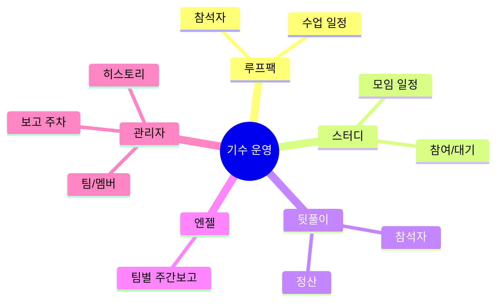
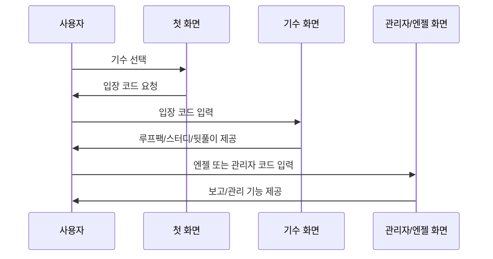
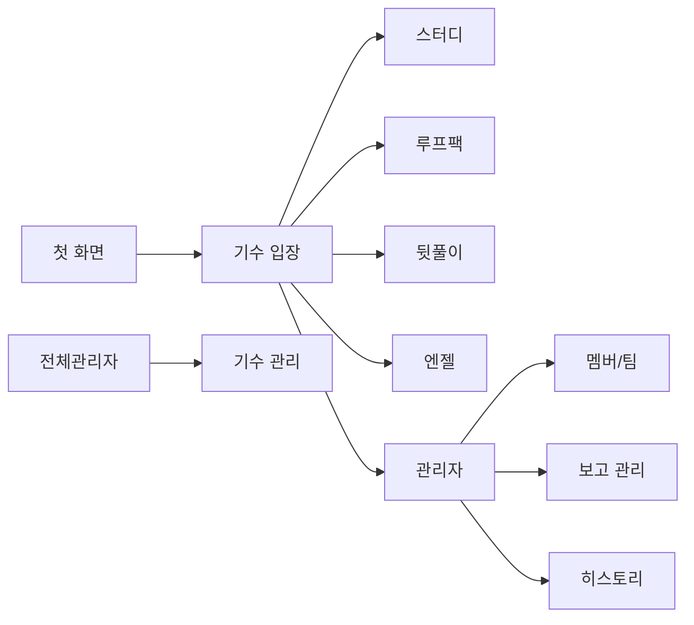

# LOOPERS MEETUP 인계 가이드

이 문서는 개발자가 아니어도 제품 구조를 이해할 수 있도록 만든 인계용 요약입니다.

## 1. 무엇을 관리하나요?

LOOPERS MEETUP은 한 기수의 오프라인 운영을 한 화면 묶음으로 관리합니다.

## 2. 사용자는 어떻게 들어오나요?

## 3. 권한은 네 가지입니다

| 권한 | 접근 위치 | 하는 일 |
| --- | --- | --- |
| 일반 입장 | 기수 입장 화면 | 루프팩, 스터디, 뒷풀이 확인/관리 |
| 엔젤 | 엔젤 화면 | 담당 팀 주간보고 작성 |
| 기수 관리자 | 관리자 화면 | 멤버, 팀, 보고, 히스토리 관리 |
| 전체관리자 | 전체관리자 화면 | 기수 생성, 코드 변경, 기수 삭제 |

전체관리자와 기수 관리자는 다릅니다. 전체관리자는 기수와 코드를 관리하고, 기수 관리자는 선택한 기수 안의 운영 데이터를 관리합니다.

## 4. 주요 화면 흐름

## 5. 인계받은 뒤 먼저 확인할 것

1. 운영 URL과 Vercel 프로젝트가 맞는지 확인합니다.
2. `.env.local` 또는 Vercel 환경 변수에 DB와 코드 값이 있는지 확인합니다.
3. `/admin`에서 기수 목록이 보이는지 확인합니다.
4. 테스트 기수를 하나 만들어 입장, 스터디, 뒷풀이, 엔젤, 관리자 화면이 열리는지 확인합니다.
5. 운영 DB를 건드리는 테스트 전에는 반드시 백업합니다.

배포 URL, DB URL, 관리자 코드 교체 절차는 `docs/operations-setup-guide.md`를 기준으로 진행합니다.

## 6. 자주 묻는 질문

### 기수를 삭제하면 데이터가 완전히 없어지나요?

아니요. 현재 삭제는 목록에서 숨기는 방식입니다. 숨겨진 기수는 새 데이터 등록을 받지 않습니다.

### 저장 버튼을 눌렀는데 반응이 느리면 어떻게 보이나요?

저장/삭제 버튼에는 스피너가 보이고, 조회나 검색이 오래 걸리면 화면 상단에 진행바가 나타납니다.

### 새 담당자는 어떤 문서부터 보면 되나요?

비개발자는 이 문서와 `docs/user-guide.md`만 먼저 보면 됩니다. 개발자는 이후 `docs/development-guide.md`와 `docs/architecture.md`를 보면 됩니다.
