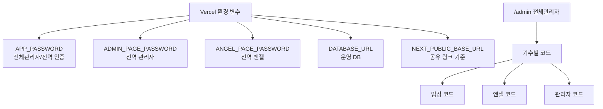
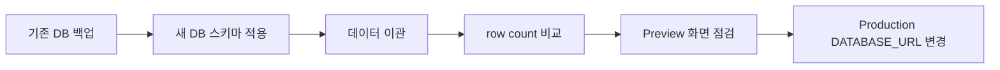

# 운영 셋업 및 인계 주의사항

이 문서는 배포 URL, DB URL, 관리자 코드를 바꿔서 새 담당자에게 넘길 때 사용하는 체크리스트입니다.

사람이 직접 따라 할 수 있고, AI 에이전트가 읽고 작업을 수행할 수 있도록 구체적으로 적었습니다. 실제 비밀번호나 DB URL은 이 문서에 적지 않습니다.

## 1. 인계 전에 모아야 할 값

| 항목 | 예시 형식 | 어디에 쓰나 | 주의 |
| --- | --- | --- | --- |
| 최종 서비스 URL | `https://example.com` | `NEXT_PUBLIC_BASE_URL` | 공유 링크 기준이므로 실제 운영 주소로 설정 |
| 새 DB URL | `postgresql://...` | `DATABASE_URL` | Supabase/Vercel 로그에 노출되지 않게 관리 |
| 전체관리자 코드 | 별도 전달 | `APP_PASSWORD` | `/admin` 진입과 기본 전역 인증에 사용 |
| 전역 관리자 코드 | 별도 전달 | `ADMIN_PAGE_PASSWORD` | 레거시/전역 관리자 역할 화면용 |
| 전역 엔젤 코드 | 별도 전달 | `ANGEL_PAGE_PASSWORD` | 레거시/전역 엔젤 역할 화면용 |
| 기수별 입장 코드 | 전체관리자 화면에서 설정 | DB 저장 | 사용자가 기수에 들어갈 때 입력 |
| 기수별 엔젤 코드 | 전체관리자 화면에서 설정 | DB 저장 | 해당 기수 엔젤 화면 접근 |
| 기수별 관리자 코드 | 전체관리자 화면에서 설정 | DB 저장 | 해당 기수 관리자 화면 접근 |
| 코드 보호용 비밀값 | 랜덤 문자열 | `OPERATING_UNIT_CODE_SECRET` | 기수별 코드 보호 저장에 사용. 운영 중 임의 변경 금지 |

## 2. 권한과 코드 위치



중요한 구분:

- `APP_PASSWORD`는 Vercel 환경 변수입니다.
- 기수별 입장/엔젤/관리자 코드는 DB에 저장되며 `/admin`의 기수 상세/수정 화면에서 관리합니다.
- 기수 삭제는 완전 삭제가 아니라 목록에서 숨기는 방식입니다.

## 3. Vercel 환경 변수 교체 절차

1. 현재 운영 환경 변수 값을 안전한 곳에 백업합니다.
2. 새 `DATABASE_URL`을 Preview 또는 Staging 환경에 먼저 넣습니다.
3. Preview에서 주요 화면이 열리는지 확인합니다.
4. Production의 `DATABASE_URL`을 새 값으로 바꿉니다.
5. Production의 `NEXT_PUBLIC_BASE_URL`을 최종 운영 URL로 바꿉니다.
6. redeploy합니다.
7. 운영 URL에서 로그인, 기수 입장, 공유 링크 복사를 확인합니다.

변경 대상:

| 변수 | 운영 전환 시 확인 |
| --- | --- |
| `DATABASE_URL` | 새 Supabase/Postgres 연결 문자열 |
| `NEXT_PUBLIC_BASE_URL` | 최종 서비스 URL |
| `APP_PASSWORD` | 새 전체관리자 코드로 바꿀지 결정 |
| `ADMIN_PAGE_PASSWORD` | 전역 관리자 코드 유지/변경 결정 |
| `ANGEL_PAGE_PASSWORD` | 전역 엔젤 코드 유지/변경 결정 |
| `OPERATING_UNIT_CODE_SECRET` | 기수별 코드 보호용 비밀값. 가능하면 운영에서 고정 |
| `OPERATING_UNITS_ENABLED` | 기수 관리 사용 시 `true` 또는 `1` |

## 4. DB URL 교체 전 확인



반드시 확인할 것:

- `npm run db:backup`으로 백업을 남겼는가
- `docs/db/01_init_schema.sql`을 새 DB에 적용했는가
- 이관 후 row count 차이가 0인가
- Preview에서 기수 목록, 모임 상세, 뒷풀이 상세, 관리자 보고가 열리는가
- Production 전환 전까지 기존 운영 DB 값을 보존했는가

자세한 DB 이전 절차는 `docs/migration/new-supabase-setup.md`와 `docs/migration/cutover-runbook.md`를 따릅니다.

## 5. 운영 전환 후 점검표

| 화면 | 확인 |
| --- | --- |
| `/` | 첫 화면이 열리고 기수 선택이 가능 |
| `/admin` | 전체관리자 코드로 기수 목록 접근 가능 |
| `/admin/operating-units` | 기수 생성/상세/수정 가능 |
| `/cohorts/{기수}/entry` | 기수 입장 코드로 입장 가능 |
| `/cohorts/{기수}/study` | 스터디 목록 표시 |
| `/cohorts/{기수}/afterparty` | 뒷풀이 목록 표시 |
| `/cohorts/{기수}/angel` | 엔젤 코드로 접근 가능 |
| `/cohorts/{기수}/admin` | 관리자 코드로 접근 가능 |
| 공유 문구 복사 | 링크가 `NEXT_PUBLIC_BASE_URL` 기준으로 생성 |

## 6. 하면 안 되는 것

- 운영 DB에서 테스트용 쓰기 E2E를 바로 실행하지 않습니다.
- 새 DB 검증 전 Production `DATABASE_URL`을 바꾸지 않습니다.
- 실제 관리자 코드나 DB URL을 문서, PR, 스크린샷에 적지 않습니다.
- `OPERATING_UNIT_CODE_SECRET`을 바꾸면 기존 기수 코드 현재값 표시나 코드 관리에 문제가 생길 수 있습니다.
- 장애 발생 시 원인을 찾기 전에 기존 DB URL 백업값을 잃어버리면 롤백이 어려워집니다.

## 7. AI 에이전트용 작업 지시 예시

아래 형식으로 값을 전달하면 됩니다. 실제 값은 안전한 채널로 전달합니다.

```text
목표: Saturday Meetup 운영 인계 셋업

운영 URL: <FINAL_BASE_URL>
새 DATABASE_URL: <NEW_DATABASE_URL>
전체관리자 코드(APP_PASSWORD): <APP_PASSWORD>
전역 관리자 코드(ADMIN_PAGE_PASSWORD): <ADMIN_PAGE_PASSWORD>
전역 엔젤 코드(ANGEL_PAGE_PASSWORD): <ANGEL_PAGE_PASSWORD>
기수 코드 보호용 비밀값(OPERATING_UNIT_CODE_SECRET): <SECRET>

해야 할 일:
1. Vercel Preview 환경에 새 DATABASE_URL과 NEXT_PUBLIC_BASE_URL을 먼저 설정
2. Preview에서 주요 화면 점검
3. 이상 없으면 Production 환경 변수 교체
4. redeploy
5. 운영 URL에서 로그인/기수 입장/공유 링크 검증

금지:
- 실제 비밀번호를 문서나 PR에 남기지 말 것
- 운영 DB에서 쓰기 E2E 실행하지 말 것
- 기존 DATABASE_URL 백업 없이 Production 값을 바꾸지 말 것
```

## 8. 인계받은 사람이 직접 할 최소 절차

1. Vercel 프로젝트 접근 권한을 받습니다.
2. Supabase 또는 Postgres 프로젝트 접근 권한을 받습니다.
3. 위 표의 환경 변수 값을 안전한 채널로 받습니다.
4. Preview 환경에 먼저 적용합니다.
5. `docs/user-guide.md`의 화면 순서대로 직접 눌러봅니다.
6. 문제가 없으면 Production 환경 변수를 바꿉니다.
7. 변경 전/후 `DATABASE_URL`과 배포 시간을 별도 운영 노트에 기록합니다.
